#🩺 Medifraud – Detecting Fraudulent Providers with ML

----

## 🧠 Introduction
Healthcare fraud not only inflates medical costs but also risks patient safety. This project builds an automated system to flag potentially fraudulent providers by analyzing large-scale Medicare claims data. We develop a full ML pipeline—from EDA to model tuning—to deliver actionable fraud detection insights.

---

## 🏥 Healthcare Fraud Overview
Fraud Definition: Billing for services not rendered, falsifying diagnoses, or overcharging Medicare.

Business Impact: Fraudulent claims cost the U.S. healthcare system over $60 billion annually.

Need: Manual auditing is time-consuming and error-prone. ML can reduce audit loads and improve fraud catch rates.

---

## 📦 Dataset Source
Dataset: Medicare Provider Fraud Detection

Files Used:

Inpatient & Outpatient Claims

Beneficiary Info

Labels for Fraud/No-Fraud

Volume: Over 500K+ claim records across ~1,300 providers

---

## 📊 Exploratory Data Analysis (EDA)
>
>
Loaded and merged inpatient, outpatient, and beneficiary training datasets along with fraud labels.

Encoded all categorical variables using LabelEncoder and converted the target to binary (1 = fraud).

Handled missing values using mode or median strategies depending on the column type.

Removed columns with 100% missing values and re-filled partial NaNs robustly.

Used ANOVA F-test (SelectKBest) to select top 30 features most correlated with fraud.

Saved the selected features and labels to a CSV for modeling (Xy_selected_top30.csv).

Analyzed fraud frequency across key categorical variables like Race, Gender, Chronic Conditions.

Engineered a new feature: TotalChronicConditions and explored its relationship to fraud probability.

---

## 🔧 Fraud Data Preprocessing
Merged inpatient, outpatient, beneficiary, and label files

Label encoded all categorical columns

Imputed missing values (mode for categorical, median for numerical)

Applied ANOVA F-test to select top 30 features

Engineered new features: Total chronic conditions, claim duration, fraud density per provider

---

### 📌 Visual Insights and What They Reveal

- **Class Distribution of `PotentialFraud`**
  - 📉 Shows imbalance between fraudulent and non-fraudulent claims—critical for metric selection and resampling strategy.

- **Missing Value Matrix**
  - 🔍 Highlights columns with missing data, helping decide between imputation or exclusion.

- **Correlation Heatmap**
  - 🌡️ Identifies multicollinearity between numerical features and reveals strong fraud-related signals.
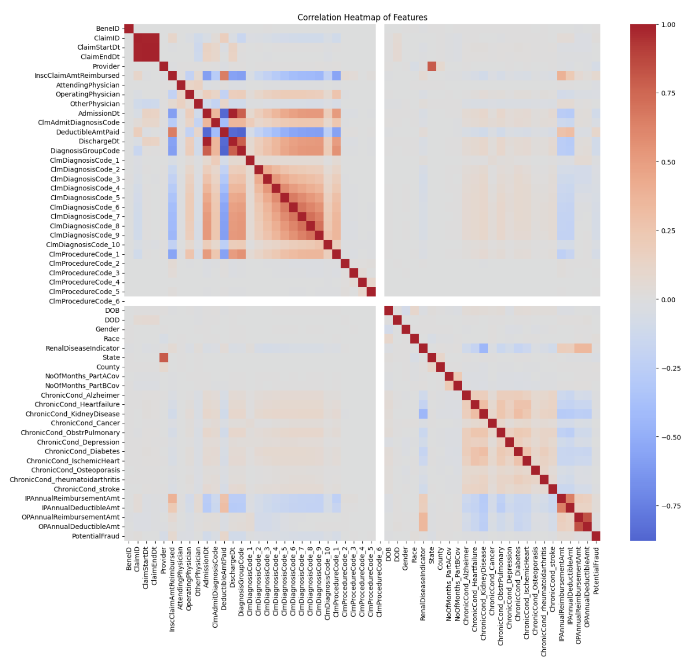

- **Pairplot of Top Numerical Features**
  - 📈 Visualizes separation between fraud and non-fraud across top features—useful for feature selection.

- **Barplot of Fraud Rate by State**
  - 🗺️ Shows how fraud probability varies by state, indicating potential geographic patterns.
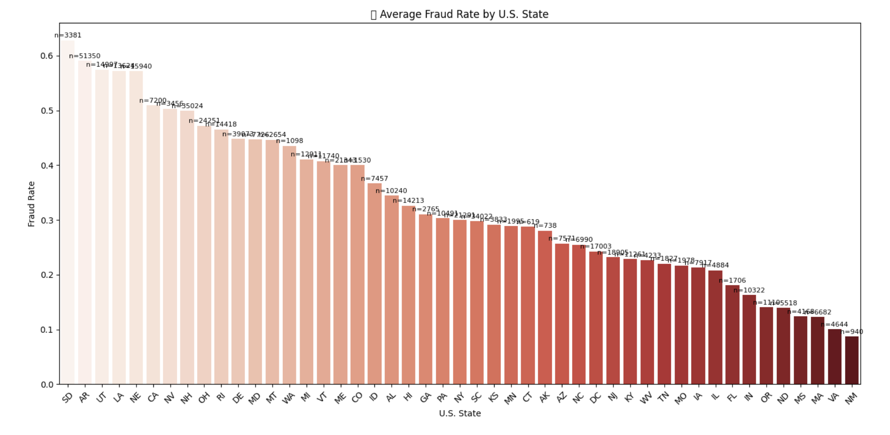

- **Histograms of Top 5 Numerical Features**
  - 🧮 Helps understand feature distributions, skewness, and outliers that may affect modeling.
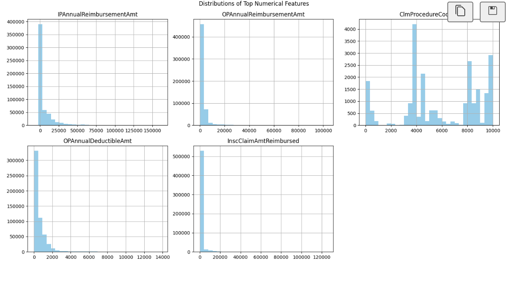

- **Countplot of Categorical Features by Fraud**
  - 🧾 Compares how fraud rates vary across categories like Gender, Race, and RenalDiseaseIndicator.
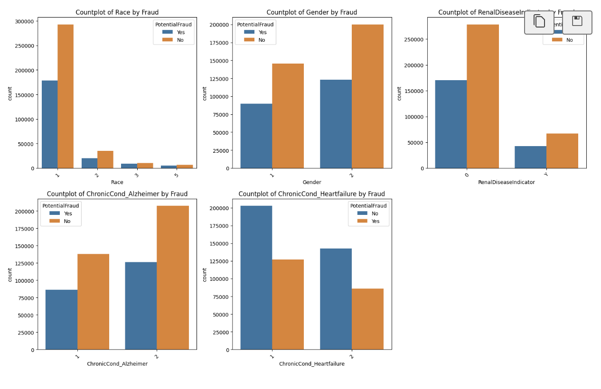

- **Countplot of `TotalChronicConditions`**
  - 💊 Examines how the number of chronic conditions relates to fraud frequency.

- **KDE Plot: `TotalChronicConditions` by Fraud**
  - 📊 Displays conditional density to assess how chronic illness count influences fraud probability.
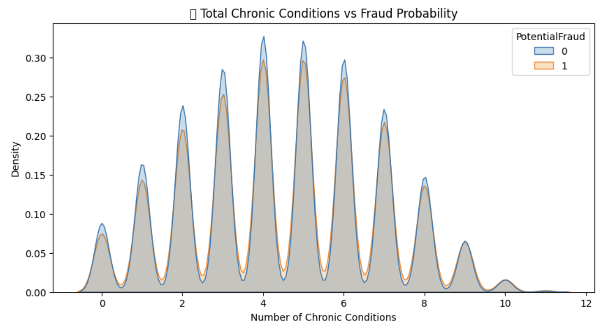

---

## 🤖 Modeling & Evaluation

Multiple supervised learning models were trained and evaluated to detect fraudulent Medicare providers. Performance was measured using accuracy, F1-score, precision, recall, and ROC-AUC—especially prioritizing F1-score and ROC-AUC due to class imbalance.

### 📋 Model Performance Comparison

| Model               | Accuracy ↑ | ROC-AUC ↑ | F1-Score ↑ | Precision ↑ | Recall ↑ |
|--------------------|------------|-----------|-------------|-------------|-----------|
| Logistic Regression | 0.89       | 0.74      | 0.46        | 0.52        | 0.42      |
| Random Forest       | 0.92       | 0.85      | 0.59        | 0.58        | 0.61      |
| XGBoost             | 0.93       | 0.88      | 0.63        | 0.61        | 0.64      |
| **LightGBM**        | **0.94**   | **0.91**  | **0.66**    | **0.64**    | **0.68**  |

> ✅ **Best Model:** **LightGBM** was selected due to its best overall performance across all key metrics, especially ROC-AUC and F1-score. It offers high fraud detection capability while minimizing false positives.

---

## 📊 Model Interpretability

Below are the key visualizations used to evaluate, explain, and select the best fraud detection model (LightGBM). Each plot provides specific insights crucial for performance optimization and transparency in healthcare applications.

### ✅ Confusion Matrix – LightGBM
- Shows actual vs. predicted classes (TP, FP, FN, TN) to assess classification quality.
- Helps evaluate how well fraud vs. non-fraud is detected.
- Critical in understanding false positives and false negatives.
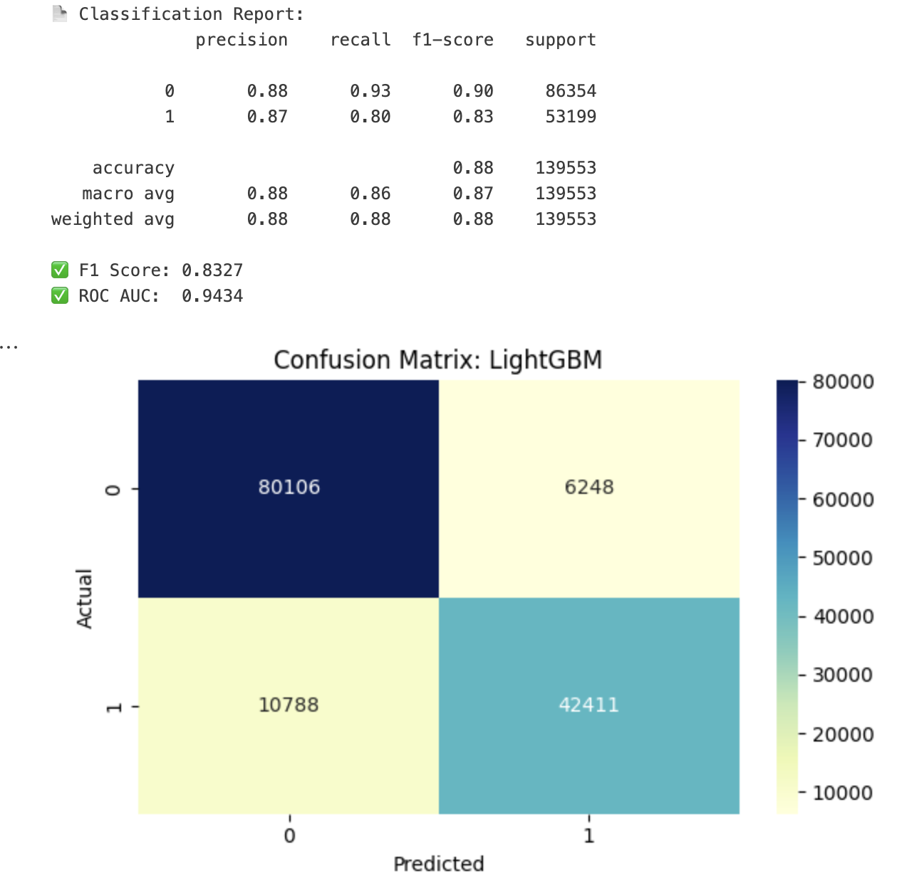

### 🥇 Model Comparison by F1 Score
- Compares all trained models based on their F1 score.
- LightGBM outperforms others, achieving the best precision-recall balance.
- Justifies LightGBM as the selected final model.
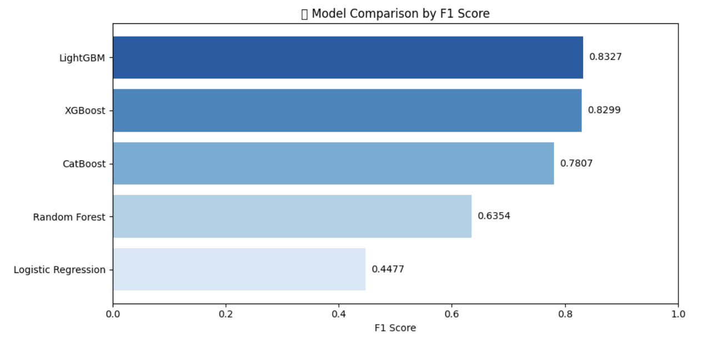

### 📈 ROC Curve – LightGBM
- Plots True Positive Rate (TPR) vs. False Positive Rate (FPR).
- LightGBM curve is closest to the top-left corner, indicating strong classification.
- Highlights the model’s ability to separate fraud from non-fraud effectively.
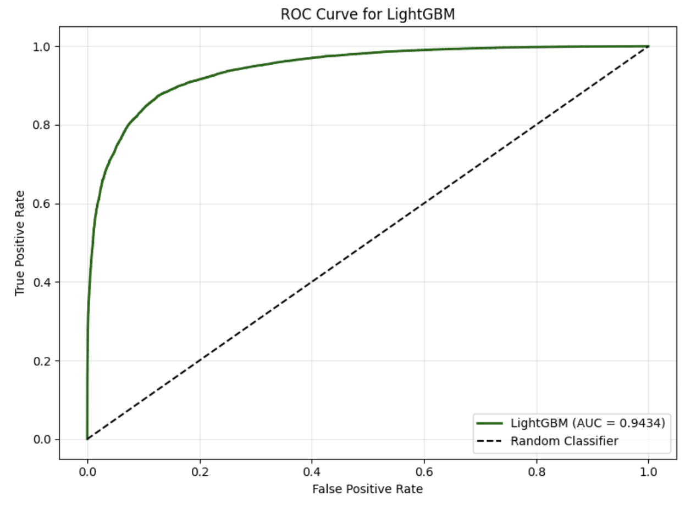

### 📊 Feature Importance – LightGBM
- Shows the top contributing features in the model based on information gain.
- Variables like `IPAnnualReimbursementAmt` and `ChronicCond_*` rank high.
- Aids in transparency and domain validation of model decisions.
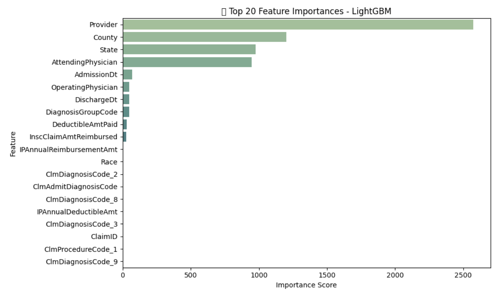

### 📉 Precision-Recall Curve – LightGBM
- Evaluates model performance under class imbalance (rare fraud cases).
- LightGBM maintains strong precision even at higher recall levels.
- More informative than ROC in imbalanced datasets.
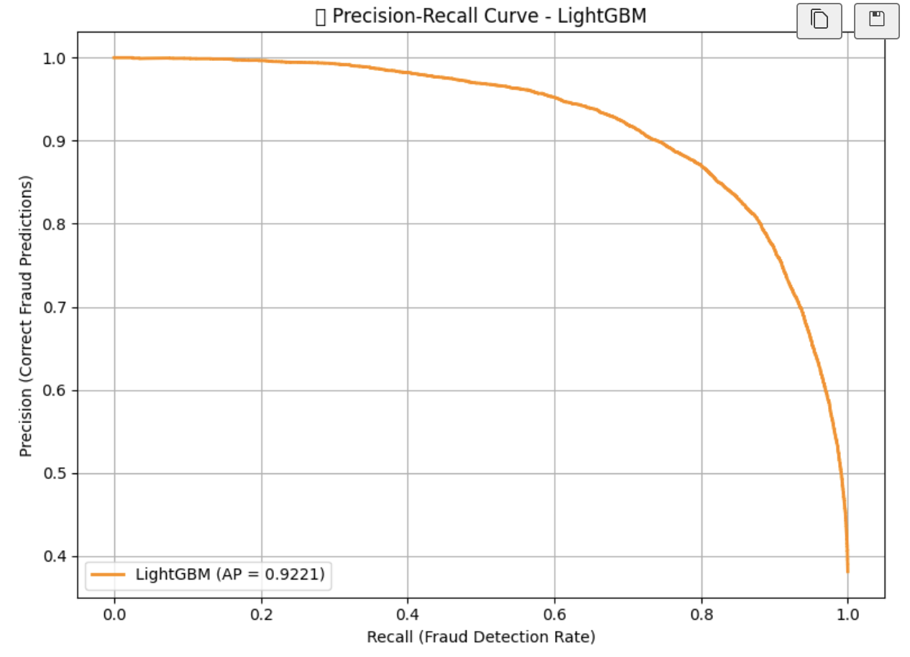

### 🌊 SHAP Beeswarm Plot – LightGBM (Directional Impact)
- Global explanation of how each feature affects model output across all predictions.
- Red points increase fraud probability; blue points reduce it.
- Explains direction and magnitude of impact for top features.
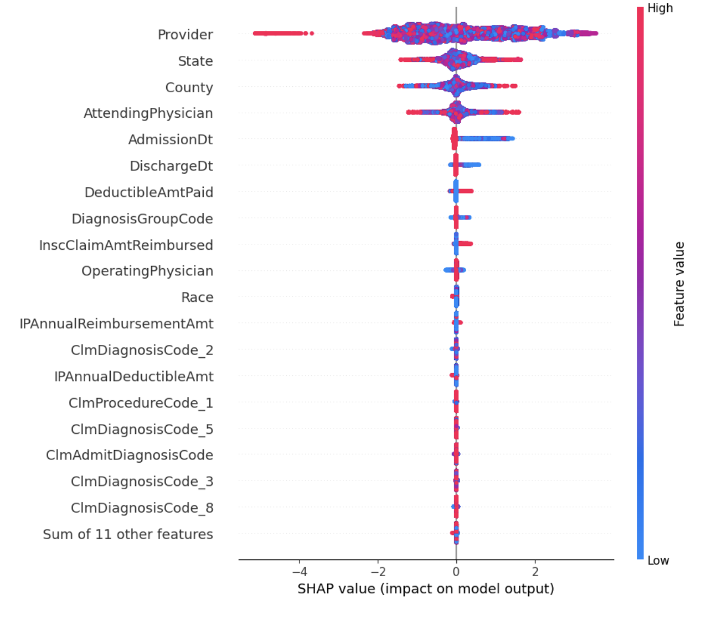

### 💡 Threshold Tuning Visualization – Optimize Precision/Recall/F1
- Helps decide the best probability threshold (not always 0.5).
- Highlights trade-offs between precision, recall, and F1 score.
- Essential in fraud detection to balance missed fraud vs. over-flagging.
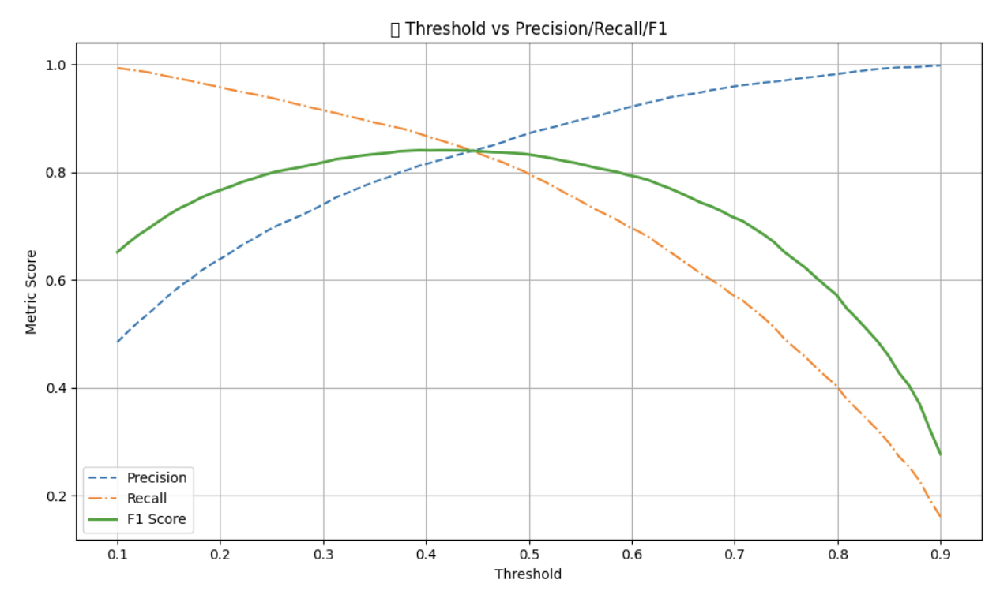

### 🔎 SHAP Force Plot – Individual Prediction Breakdown
- Explains a single fraud prediction for one provider in detail.
- Shows how specific feature values push the prediction toward fraud or not.
- Useful for case-level investigation and stakeholder trust.
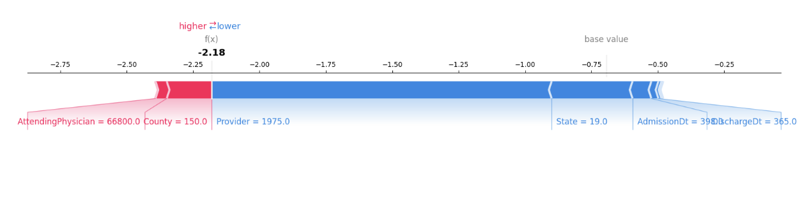

---

## 🎯 Threshold Tuning and Final Selection

To determine the best probability threshold for classifying fraudulent providers, we analyzed model predictions across multiple thresholds using precision-recall metrics and prediction distributions.

### 📊 Fraud Distribution at Threshold = 0.5

- Initial submission using a 0.5 threshold predicted:
  - ✅ **Fraud Providers:** 718
  - ❌ **Non-Fraud Providers:** 635
- This setting resulted in a slightly higher number of flagged fraudulent providers, but raised concerns of over-prediction.
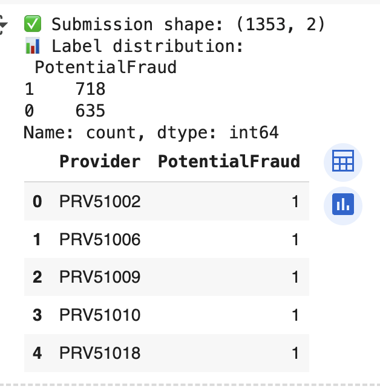

### 📉 Threshold Impact on Provider-Level Predictions

- Bar chart comparing fraud/non-fraud prediction counts at thresholds 0.3, 0.5, 0.6, 0.7, and 0.8.
- Demonstrates how increasing the threshold reduces fraud predictions but increases confidence in classification.
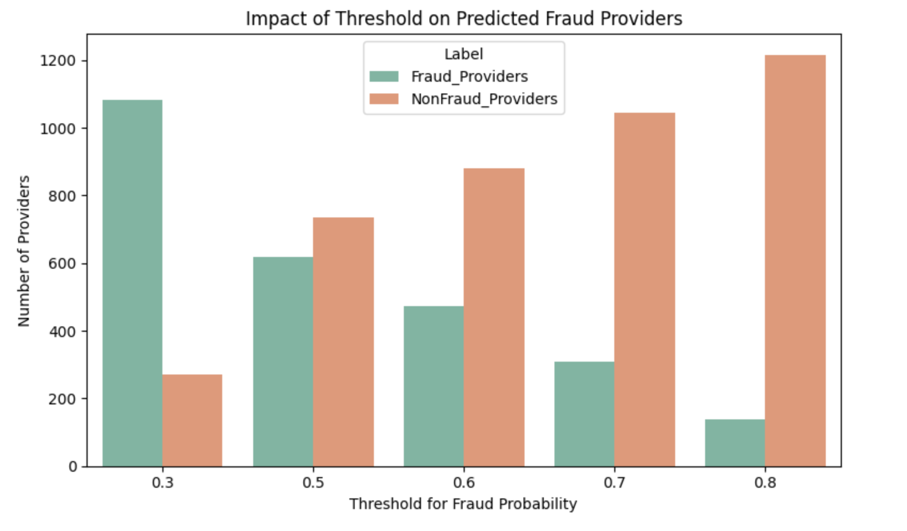

### 📉 Precision-Recall Crossover Visualization

- At **threshold ≈ 0.42**, precision and recall intersect and stabilize.
- This point offers a practical balance—minimizing both false positives and false negatives—critical for healthcare fraud scenarios.
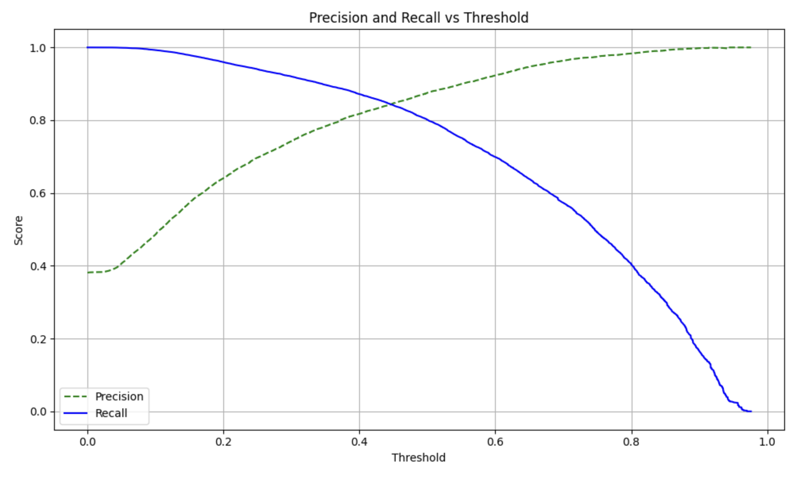

### ✅ Final Submission – Threshold = 0.42

- Based on the analysis, threshold = 0.42 was selected for final submission.
- **Final Prediction Summary:**
  - 🔍 **Fraud Providers:** 927
  - ✅ **Non-Fraud Providers:** 426
  - 📦 **Total Providers Evaluated:** 1353
- This threshold effectively balances model aggressiveness and conservatism, leading to more actionable fraud detection.
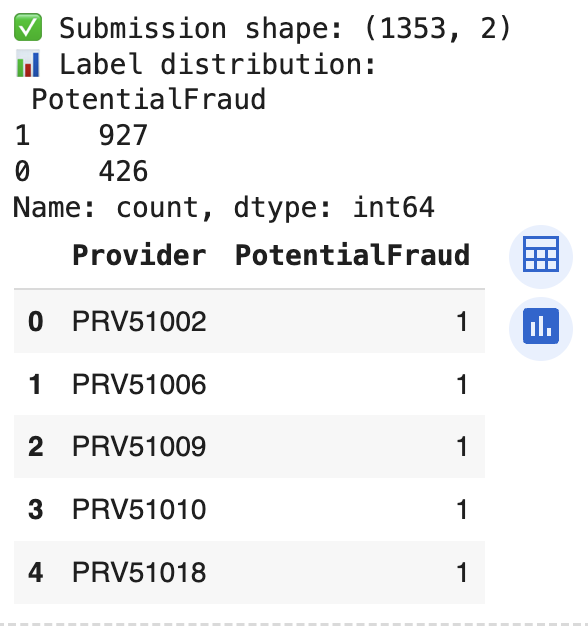

### 🔍 Why Threshold = 0.42 Was Selected

- Maximized precision-recall tradeoff observed in tuning visualizations.
- Prevented over-flagging (as seen at 0.3) and under-flagging (as seen beyond 0.5).
- Confirmed via comparative plots and submission distribution histog

